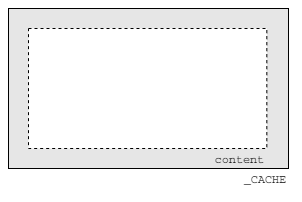

# Simple-Terminal-UI
Simply make your own Terminal UI in Python!

## Main Function

### Text
the `TypeRender` can automatic render the form text to TUI display:

Functions:

- Pure text
- Basic Math render with Unicode (Plan)
- HUGE text (Plan)

```
┌─Introduction───────────────────────────────────┐
│This is a demo of terminal UI.                  │ 
│I will show you how to use it.                  │ 
│Or I can use the temp to show you. using name of│ 
│ temp.                                          │ 
│                                                │ 
│                                                │ 
│                                                │ 
│                                                │ 
└────────────────────────────────────────────────┘
```

### Progress Bar

### Chart (Plan)

## Develop

### Terminal Enviorment


### UI Element



